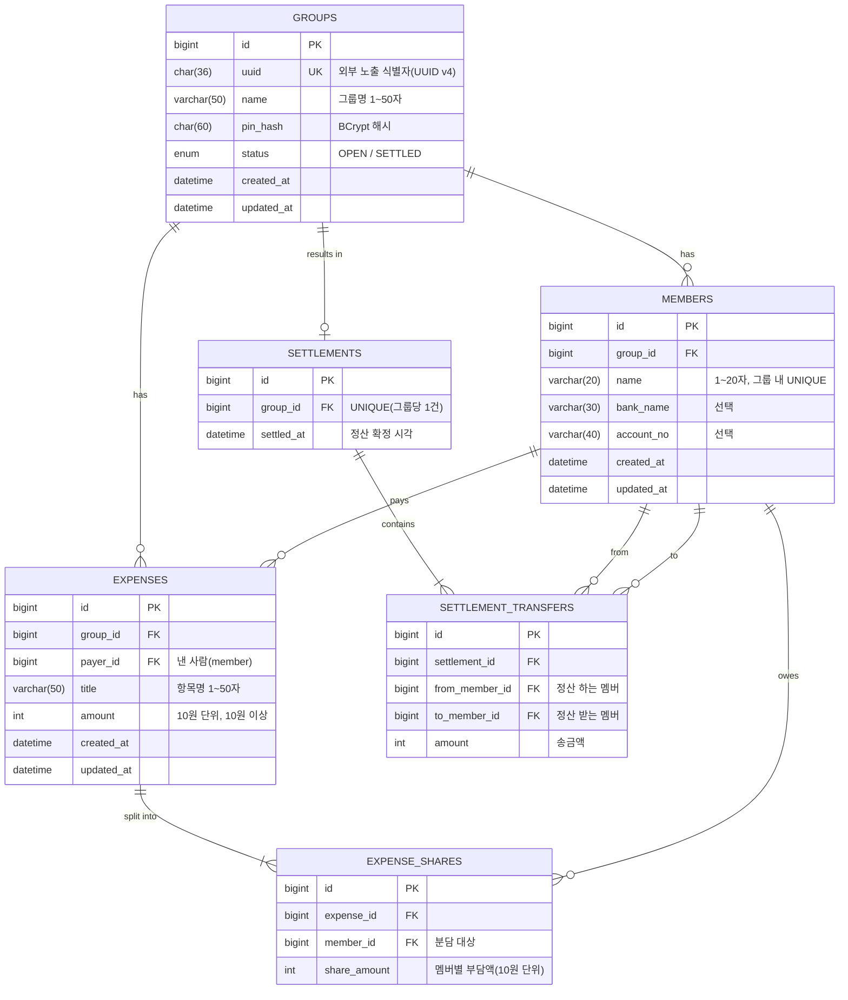

# 데이터 모델 설계서 (ERD)

## 그룹 정산 관리 시스템 (GroupPay)

| 항목          | 내용                                                        |
| ------------- | ----------------------------------------------------------- |
| 문서 버전     | v1.0                                                        |
| 작성일        | 2026-05-20                                                  |
| 작성자        | -                                                           |
| 프로세스 단계 | 설계 (상세 설계)                                            |
| 참조 문서     | requirements.md v1.0, usecase.md v1.0, architecture.md v1.0 |
| 상태          | 초안 (Draft)                                                |

---

## 목차

1. 목적 및 범위
2. 설계 원칙
3. ERD (개체-관계도)
4. 엔티티 상세 명세
5. 관계 및 카디널리티
6. 인덱스 설계
7. 엔티티-요구사항 추적표

---

## 1. 목적 및 범위

본 문서는 requirements.md 부록 B에서 예비 식별한 도메인 엔티티(Group, Member,
Expense, ExpenseShare, Settlement)를 관계형 데이터 모델로 구체화한다.
architecture.md 3장에서 선정한 MySQL 8.x + Spring Data JPA 환경을 전제로
테이블 구조, 컬럼 제약, 관계, 인덱스를 정의한다.

물리적 마이그레이션 스크립트(DDL)는 구현 단계에서 JPA 엔티티 기반으로 생성하며,
본 문서는 논리·물리 설계의 기준선으로 사용한다.

---

## 2. 설계 원칙

- 모든 테이블은 단일 대리키(`BIGINT AUTO_INCREMENT id`)를 PK로 둔다.
  단, `groups`는 외부 노출 식별자로 `uuid`(UNIQUE)를 별도 보유한다(CON-01, FR-04).
- 그룹 삭제 시 하위 데이터 전체가 함께 제거되도록 FK에 `ON DELETE CASCADE`를 적용한다(FR-03).
- 금액은 원화(KRW) 정수만 다루므로 `INT`(또는 `BIGINT`)를 사용하고 소수·통화 컬럼을 두지 않는다(CON-02).
- PIN은 평문을 저장하지 않으며 BCrypt 해시 문자열만 보관한다(NFR-08).
- 그룹 상태는 `ENUM('OPEN','SETTLED')`로 제한하여 단방향 전이를 데이터 차원에서 보조한다(SRS 2.2).
- 생성·수정 시각(`created_at`, `updated_at`)을 공통 컬럼으로 둔다.

---

## 3. ERD (개체-관계도)

> 설계 메모: requirements.md 부록 B의 `Settlement` 단일 엔티티를
> `settlements`(정산 헤더) + `settlement_transfers`(개별 송금 행)로 분해했다.
> 최소 송금 산출 결과(FR-20)가 "A→B: 금액" 형태의 행 집합이므로, 정규화하여
> 송금 1건을 1행으로 저장한다. 멤버별 순잔액은 송금 행으로부터 도출 가능하여 별도 저장하지 않는다.

---

## 4. 엔티티 상세 명세

### 4.1 groups

| 컬럼       | 타입                   | 제약                     | 설명                         |
| ---------- | ---------------------- | ------------------------ | ---------------------------- |
| id         | BIGINT                 | PK, AUTO_INCREMENT       | 내부 식별자                  |
| uuid       | CHAR(36)               | UNIQUE, NOT NULL         | 외부 노출 식별자 (UUID v4)   |
| name       | VARCHAR(50)            | NOT NULL                 | 그룹명 (1~50자)              |
| pin_hash   | CHAR(60)               | NOT NULL                 | BCrypt 해시 (평문 저장 금지) |
| status     | ENUM('OPEN','SETTLED') | NOT NULL, DEFAULT 'OPEN' | 그룹 상태                    |
| created_at | DATETIME               | NOT NULL                 | 생성 시각                    |
| updated_at | DATETIME               | NOT NULL                 | 수정 시각                    |

### 4.2 members

| 컬럼       | 타입        | 제약                               | 설명               |
| ---------- | ----------- | ---------------------------------- | ------------------ |
| id         | BIGINT      | PK, AUTO_INCREMENT                 | 내부 식별자        |
| group_id   | BIGINT      | FK → groups(id), ON DELETE CASCADE | 소속 그룹          |
| name       | VARCHAR(20) | NOT NULL                           | 멤버 이름 (1~20자) |
| bank_name  | VARCHAR(30) | NULL                               | 은행명 (선택)      |
| account_no | VARCHAR(40) | NULL                               | 계좌번호 (선택)    |
| created_at | DATETIME    | NOT NULL                           | 생성 시각          |
| updated_at | DATETIME    | NOT NULL                           | 수정 시각          |

> 제약: `UNIQUE(group_id, name)` — 그룹 내 이름 중복 불가(FR-06).
> 계좌는 지출 등록 멤버만 등록 가능하나, 이는 애플리케이션 계층 규칙으로 강제한다(FR-07).

### 4.3 expenses

| 컬럼       | 타입        | 제약                               | 설명             |
| ---------- | ----------- | ---------------------------------- | ---------------- |
| id         | BIGINT      | PK, AUTO_INCREMENT                 | 내부 식별자      |
| group_id   | BIGINT      | FK → groups(id), ON DELETE CASCADE | 소속 그룹        |
| payer_id   | BIGINT      | FK → members(id)                   | 낸 사람          |
| title      | VARCHAR(50) | NOT NULL                           | 항목명 (1~50자)  |
| amount     | INT         | NOT NULL, CHECK(amount >= 10)      | 금액 (10원 단위) |
| created_at | DATETIME    | NOT NULL                           | 생성 시각        |
| updated_at | DATETIME    | NOT NULL                           | 수정 시각        |

### 4.4 expense_shares

| 컬럼         | 타입   | 제약                                 | 설명           |
| ------------ | ------ | ------------------------------------ | -------------- |
| id           | BIGINT | PK, AUTO_INCREMENT                   | 내부 식별자    |
| expense_id   | BIGINT | FK → expenses(id), ON DELETE CASCADE | 대상 지출      |
| member_id    | BIGINT | FK → members(id)                     | 분담 대상 멤버 |
| share_amount | INT    | NOT NULL                             | 멤버별 부담액  |

> 제약: `UNIQUE(expense_id, member_id)` — 한 지출에 같은 멤버 중복 분담 불가.
> `Σ share_amount = expenses.amount`는 등록·수정 시 애플리케이션에서 검증(FR-11).

### 4.5 settlements

| 컬럼       | 타입     | 제약                                       | 설명           |
| ---------- | -------- | ------------------------------------------ | -------------- |
| id         | BIGINT   | PK, AUTO_INCREMENT                         | 내부 식별자    |
| group_id   | BIGINT   | FK → groups(id), ON DELETE CASCADE, UNIQUE | 그룹당 1건     |
| settled_at | DATETIME | NOT NULL                                   | 정산 확정 시각 |

> `UNIQUE(group_id)` 제약으로 그룹당 정산 1건을 데이터 차원에서 보장(FR-18 중복 확정 거부).

### 4.6 settlement_transfers

| 컬럼           | 타입   | 제약                                    | 설명           |
| -------------- | ------ | --------------------------------------- | -------------- |
| id             | BIGINT | PK, AUTO_INCREMENT                      | 내부 식별자    |
| settlement_id  | BIGINT | FK → settlements(id), ON DELETE CASCADE | 소속 정산      |
| from_member_id | BIGINT | FK → members(id)                        | 정산 하는 멤버 |
| to_member_id   | BIGINT | FK → members(id)                        | 정산 받는 멤버 |
| amount         | INT    | NOT NULL, CHECK(amount > 0)             | 송금액         |

> 최소 송금 산출(FR-20) 결과 1건이 1행에 대응한다.

---

## 5. 관계 및 카디널리티

| 관계                               | 카디널리티 | 삭제 규칙                       | 근거         |
| ---------------------------------- | ---------- | ------------------------------- | ------------ |
| groups — members                   | 1 : N      | CASCADE                         | FR-03, FR-06 |
| groups — expenses                  | 1 : N      | CASCADE                         | FR-03, FR-10 |
| groups — settlements               | 1 : 0..1   | CASCADE                         | FR-18        |
| members — expenses (payer)         | 1 : N      | RESTRICT(앱 제어)               | FR-10        |
| expenses — expense_shares          | 1 : N (≥1) | CASCADE                         | FR-11        |
| members — expense_shares           | 1 : N      | CASCADE(멤버 제거 시 함께 삭제) | FR-08        |
| settlements — settlement_transfers | 1 : N (≥1) | CASCADE                         | FR-20        |
| members — settlement_transfers     | 1 : N      | -                               | FR-20        |

> 멤버 제거(FR-08): 해당 멤버의 지출·분담 내역이 있으면 경고 후 함께 삭제한다.
> payer_id 참조 무결성은 애플리케이션 계층에서 "지출 동반 삭제"로 처리한다.

---

## 6. 인덱스 설계

| 테이블               | 인덱스                 | 목적                                  |
| -------------------- | ---------------------- | ------------------------------------- |
| groups               | UNIQUE(uuid)           | UUID 링크 조회 (FR-04, 모든 API 진입) |
| members              | INDEX(group_id)        | 그룹별 멤버 목록 조회                 |
| members              | UNIQUE(group_id, name) | 그룹 내 이름 중복 방지                |
| expenses             | INDEX(group_id)        | 그룹별 지출 목록 조회 (FR-22)         |
| expense_shares       | INDEX(expense_id)      | 지출별 분담 조회                      |
| expense_shares       | INDEX(member_id)       | 멤버별 부담액 집계 (순잔액 계산)      |
| settlements          | UNIQUE(group_id)       | 그룹당 정산 1건 보장                  |
| settlement_transfers | INDEX(settlement_id)   | 정산 결과 송금 목록 조회 (FR-21)      |

---

## 7. 엔티티-요구사항 추적표

| 엔티티               | 대응 FR                           | 대응 UC        |
| -------------------- | --------------------------------- | -------------- |
| groups               | FR-01~05, FR-18                   | UC-01,02,03,06 |
| members              | FR-06, FR-07, FR-08               | UC-04          |
| expenses             | FR-10, FR-12, FR-13, FR-14, FR-22 | UC-05          |
| expense_shares       | FR-11, FR-14, FR-19               | UC-05, UC-06   |
| settlements          | FR-18                             | UC-06          |
| settlement_transfers | FR-20, FR-21, FR-09               | UC-06, UC-07   |

---

_본 문서는 상세 설계 단계의 산출물이며, 스키마 변경 시 변경 이력을 기록하여 SRS·아키텍처와의 추적성을 유지한다._
