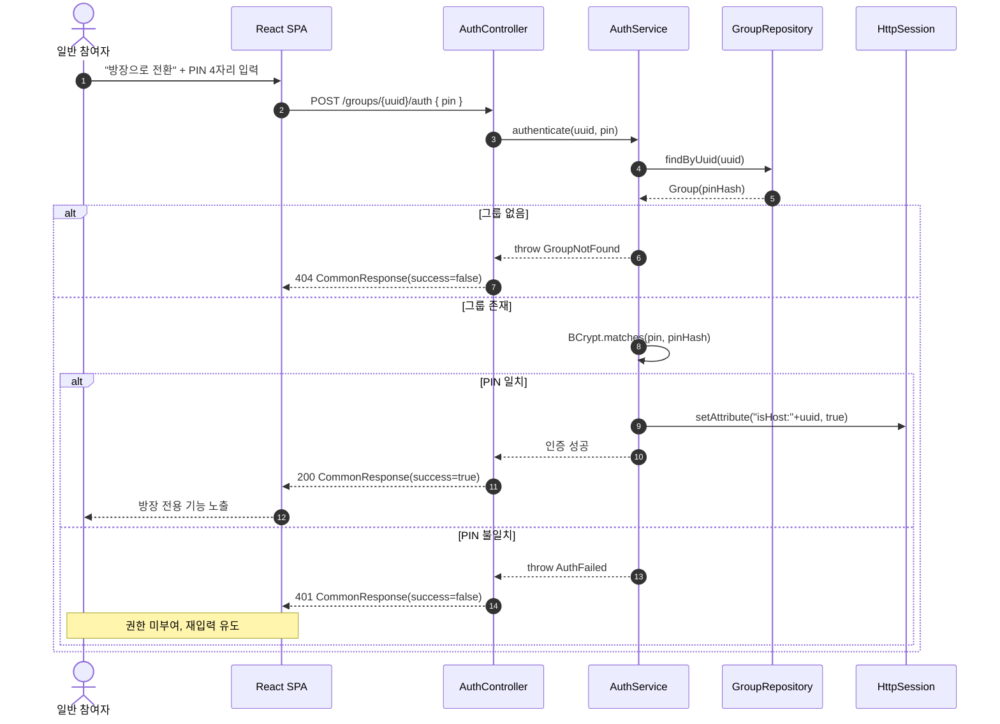
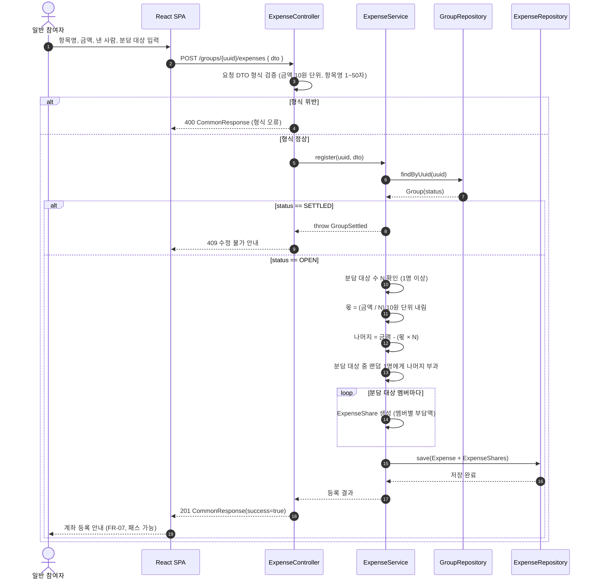
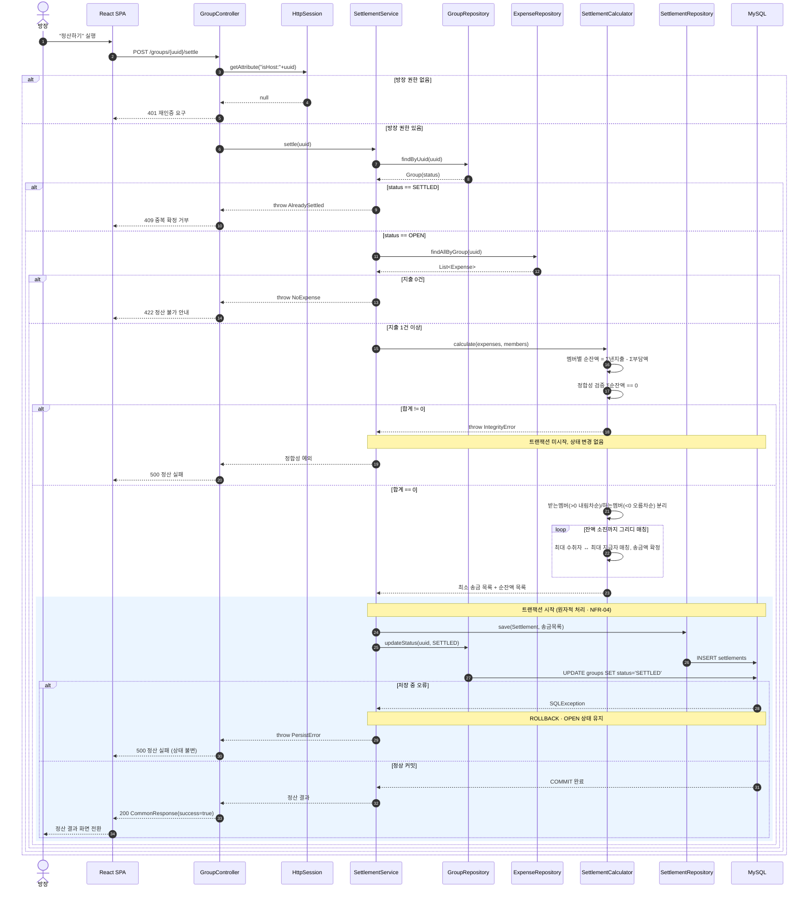
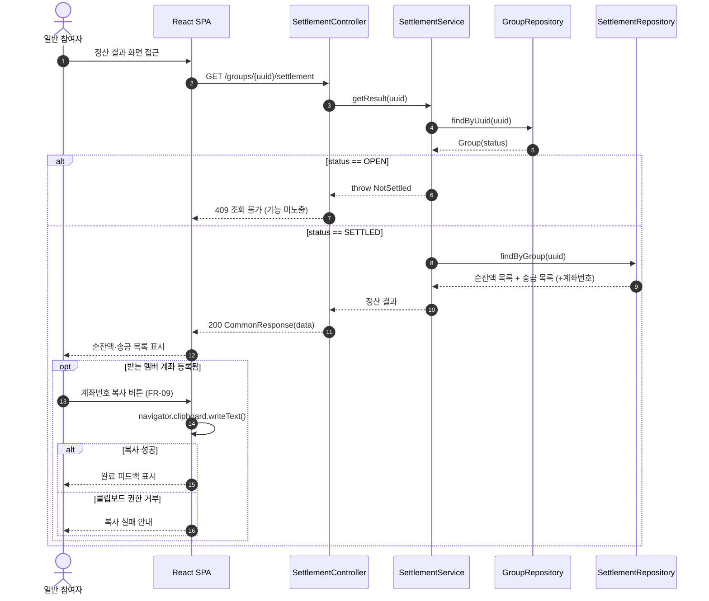

# 시퀀스 다이어그램 (Sequence Diagram)

## 그룹 정산 관리 시스템 (GroupPay)

| 항목          | 내용                                                        |
| ------------- | ----------------------------------------------------------- |
| 문서 버전     | v1.0                                                        |
| 작성일        | 2026-05-19                                                  |
| 작성자        | -                                                           |
| 프로세스 단계 | 설계 (상세 설계)                                            |
| 참조 문서     | requirements.md v1.0, usecase.md v1.0, architecture.md v1.0 |
| 상태          | 초안 (Draft)                                                |

---

## 목차

1. 목적 및 범위
2. 표기 규약
3. 참여 객체 (Lifeline)
4. SD-01 방장 PIN 인증 (FR-05)
5. SD-02 지출 등록 — 1/N 균등 분담 (UC-05 / FR-10, 11, 14)
6. SD-03 정산 확정 (UC-06 / FR-18, 19, 20)
7. SD-04 정산 결과 조회 (UC-07 / FR-21, 09)
8. 시퀀스-유스케이스-계층 추적표

---

## 1. 목적 및 범위

본 문서는 GroupPay의 핵심 유스케이스를 3계층 아키텍처(Presentation → Business → Data Access)
위에서 객체 간 메시지 흐름으로 구체화하여, 유스케이스 명세(usecase.md)와 구현 코드 사이의
설계 공백을 메운다.

대상은 흐름이 복잡하거나 트랜잭션·정합성 검증이 얽힌 핵심 유스케이스로 한정한다.
단순 CRUD(그룹명 수정, 멤버 추가 등)는 동일 패턴의 반복이므로 본 문서에서 생략한다.

각 다이어그램은 architecture.md 4.2절의 계층 구분 및 5.5절 처리 흐름과 일관되도록 작성되었다.

---

## 2. 표기 규약

- `Controller`는 Presentation 계층, `Service` / `SettlementCalculator`는 Business 계층,
  `Repository` / DB는 Data Access 계층에 속한다.
- `alt` / `opt`는 분기, `loop`는 반복, 빨간 `Note`는 예외·롤백 경로를 나타낸다.
- 정산 확정처럼 원자성이 요구되는 구간은 `rect`(트랜잭션 경계)로 묶어 표현한다.
- 메시지의 괄호 안 식별자(FR-xx)는 대응 요구사항을 가리킨다.

---

## 3. 참여 객체 (Lifeline)

| 객체                   | 계층         | 역할                                          |
| ---------------------- | ------------ | --------------------------------------------- |
| 일반 참여자 / 방장     | Actor        | 브라우저를 통한 사용자                        |
| React SPA              | Client       | 화면 렌더링, API 호출                         |
| `*Controller`          | Presentation | 요청 수신, DTO 변환, CommonResponse 래핑      |
| `*Service`             | Business     | 비즈니스 로직, 상태 전이, 권한 확인           |
| `SettlementCalculator` | Business     | 순잔액·최소 송금 계산 (단위 테스트 핵심 대상) |
| `*Repository`          | Data Access  | JPA 기반 영속성 처리                          |
| MySQL                  | Data Access  | 데이터 저장, 트랜잭션 보장                    |
| HttpSession            | Infra        | 방장 권한 플래그 보관                         |

---

## 4. SD-01 방장 PIN 인증 (FR-05)

방장 전용 유스케이스(UC-03/04/06)의 선행조건. 세션에 권한 플래그를 심는 것이 핵심이다.

**예외·대안 흐름**

- 세션 만료 후 방장 기능 접근 시: 권한 플래그 부재 → 재인증 요구(UC-03 1b).

---

## 5. SD-02 지출 등록 — 1/N 균등 분담 (UC-05 / FR-10, 11, 14)

분담 금액 계산과 10원 단위 나머지 처리가 핵심. 그룹 상태(OPEN) 가드가 선행된다.

**예외·대안 흐름**

- 분담 대상 0명 → 오류(1명 이상 필요), 3단계 복귀.
- 낸 사람이 분담 대상에 포함 → 본인 몫은 순잔액 계산 시 자동 차감(정산 단계에서 반영).

---

## 6. SD-03 정산 확정 (UC-06 / FR-18, 19, 20)

본 시스템에서 가장 복잡한 흐름. 권한·상태·건수 가드 → 계산 → 정합성 검증 → **트랜잭션 내 원자적 저장/상태 전이**가 핵심이다.

**설계 메모**

- 4~7단계(계산·저장·상태 전이)는 단일 트랜잭션 경계 안에서 처리하여 부분 반영을 차단한다(NFR-04).
- `SettlementCalculator`는 외부 의존성 없는 순수 계산 객체로 분리하여 단위 테스트 커버리지 80%(NFR-10)를 확보한다.
- 정합성 검증(Σ=0)은 저장 이전에 수행해 불필요한 트랜잭션 시작을 막는다.

---

## 7. SD-04 정산 결과 조회 (UC-07 / FR-21, 09)

SETTLED 상태에서만 노출되는 조회 전용 흐름. 계좌번호 복사는 클라이언트 측에서 처리된다.

---

## 8. 시퀀스-유스케이스-계층 추적표

| SD ID | 다이어그램명   | 대응 UC            | 대응 FR       | 주요 계층 흐름                                           |
| ----- | -------------- | ------------------ | ------------- | -------------------------------------------------------- |
| SD-01 | 방장 PIN 인증  | UC-03/04/06 (선행) | FR-05         | Controller → Service → Repository → Session              |
| SD-02 | 지출 등록(1/N) | UC-05              | FR-10, 11, 14 | Controller → Service(계산) → Repository                  |
| SD-03 | 정산 확정      | UC-06              | FR-18, 19, 20 | Controller → Service → Calculator → Repository(트랜잭션) |
| SD-04 | 정산 결과 조회 | UC-07              | FR-21, 09     | Controller → Service → Repository (+클라이언트 복사)     |

> 생략된 단순 흐름: 그룹 생성(UC-01), 그룹 접근(UC-02), 그룹명 수정/삭제(UC-03), 멤버 추가/제거(UC-04),
> 지출 수정/삭제(UC-05). 모두 `Controller → Service → Repository` 단방향 CRUD 패턴을 따른다.

---

_본 문서는 상세 설계 단계의 산출물이며, 구현 중 흐름 변경 시 변경 이력을 기록하여 SRS·유스케이스 명세와의 추적성을 유지한다._
