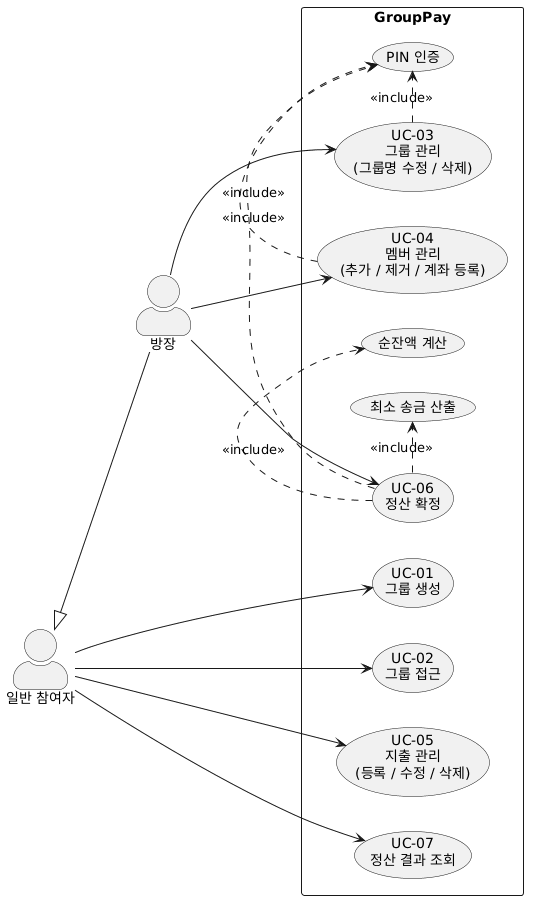

# 유스케이스 명세서 (Use Case Specification)

## 그룹 정산 관리 시스템 (GroupPay)

| 항목          | 내용                                       |
| ------------- | ------------------------------------------ |
| 문서 버전     | v1.0                                       |
| 작성일        | 2026-05-19                                 |
| 작성자        | -                                          |
| 프로세스 단계 | 요구사항 분석 / 설계 연계                  |
| 참조 문서     | requirements.md v1.0, architecture.md v1.0 |
| 상태          | 기준선 확정 (Baselined)                    |

---

## 목차

1. 목적 및 범위
2. 액터 식별
3. 유스케이스 목록
4. 유스케이스 다이어그램
5. 유스케이스 명세
6. 유스케이스-요구사항 추적표

---

## 1. 목적 및 범위

본 문서는 GroupPay의 기능 요구사항(SRS FR-01~FR-22)을 사용자 목표(goal) 단위의
유스케이스로 재구성하여, SRS와 이후 설계 산출물(클래스 다이어그램, 시퀀스 다이어그램, API 명세) 사이의
추적성을 연결한다.

FR 단위의 세부 기능은 각 유스케이스의 흐름(주 흐름 / 대안·예외 흐름) 안에서 기술하며,
상세 알고리즘(정산 계산)과 API 요청/응답 스키마는 본 문서의 범위에서 제외한다.

---

## 2. 액터 식별

| 액터        | 유형      | 설명                                                                                               |
| ----------- | --------- | -------------------------------------------------------------------------------------------------- |
| 일반 참여자 | 주요(1차) | UUID 링크로 그룹에 접속한 사용자. 지출 관리 및 정산 결과 조회를 수행한다                           |
| 방장        | 주요(1차) | PIN 인증을 거쳐 관리 권한을 획득한 일반 참여자. 그룹·멤버 관리 및 정산 확정 권한을 추가로 보유한다 |

> **액터 일반화**: 방장은 일반 참여자의 특수화(specialization)이다.
> 일반 참여자의 모든 유스케이스를 수행할 수 있으며, 방장 전용 유스케이스가 추가된다.
>
> **PIN 인증 처리**: PIN 인증은 독립 유스케이스가 아니라 방장 전용 유스케이스(UC-03, UC-04, UC-06)의
> 선행조건 및 주 흐름 첫 단계로 처리한다.
> 사용자 목표가 "PIN 인증 자체"가 아닌 "방장 권한으로 특정 기능 수행"이기 때문이다.

---

## 3. 유스케이스 목록

| UC ID | 유스케이스명   | 주 액터     | 대응 FR                           | 우선순위 |
| ----- | -------------- | ----------- | --------------------------------- | -------- |
| UC-01 | 그룹 생성      | 일반 참여자 | FR-01                             | P1       |
| UC-02 | 그룹 접근      | 일반 참여자 | FR-04                             | P1       |
| UC-03 | 그룹 관리      | 방장        | FR-02, FR-03                      | P1       |
| UC-04 | 멤버 관리      | 방장        | FR-06, FR-07, FR-08               | P1       |
| UC-05 | 지출 관리      | 일반 참여자 | FR-10, FR-11, FR-12, FR-13, FR-14 | P1       |
| UC-06 | 정산 확정      | 방장        | FR-18, FR-19, FR-20               | P1       |
| UC-07 | 정산 결과 조회 | 일반 참여자 | FR-09, FR-21, FR-22               | P1/P2    |

---

## 4. 유스케이스 다이어그램

---

## 5. 유스케이스 명세

---

### UC-01 그룹 생성 `P1`

| 항목     | 내용                                                                      |
| -------- | ------------------------------------------------------------------------- |
| 주 액터  | 일반 참여자                                                               |
| 목적     | 새 정산 그룹을 멤버와 함께 생성하고 공유 가능한 접근 링크를 발급받는다     |
| 선행조건 | 없음                                                                      |
| 후행조건 | 그룹이 OPEN 상태로 생성되고(멤버 동반 생성) UUID 링크가 발급된다. PIN은 해시되어 저장되며, 생성자 세션에 방장 권한이 부여된다 |

**주 흐름**

1. 사용자가 온보딩 화면에서 "새 그룹 만들기"를 선택한다.
2. 시스템이 그룹명·PIN 입력 폼을 표시한다.
3. 사용자가 그룹명(1~50자)과 PIN(숫자 4자리)을 입력하고 다음 단계로 진행한다.
4. 시스템이 멤버 등록 화면을 표시하고, 사용자가 함께 정산할 멤버 이름(각 1~20자)을 추가한다(0명 허용).
5. 사용자가 "완료"를 요청한다.
6. 시스템이 입력값의 형식과 멤버 이름 중복을 검증한다.
7. 시스템이 UUID v4를 생성하고 PIN을 BCrypt로 해시하여, **그룹과 멤버를 단일 트랜잭션으로 원자적으로** OPEN 상태로 저장한다.
8. 시스템이 생성자 세션에 방장 권한을 부여한다(생성자는 PIN 설정 당사자이므로 별도 인증 불필요).
9. 시스템이 UUID가 포함된 접근 링크를 사용자에게 제공한다.

**대안·예외 흐름**

- 6a. 그룹명이 1~50자 범위를 벗어남 → 오류 메시지 표시 후 3단계로 복귀.
- 6b. PIN이 숫자 4자리가 아님 → 오류 메시지 표시 후 3단계로 복귀.
- 6c. 멤버 이름이 1~20자 범위를 벗어나거나 목록 내 중복 → 오류 메시지 표시 후 4단계로 복귀.
- 7a. 저장 중 오류 → 트랜잭션 전체 롤백, 그룹·멤버 모두 미생성(반쪽 그룹 방지).

> **비고**: 멤버 동반 생성은 FR-06(멤버 추가)의 초기 등록을 그룹 생성 흐름에 통합한 것이다.
> 생성 이후의 멤버 추가/제거는 방장 권한이 필요한 UC-04에서 다룬다.

---

### UC-02 그룹 접근 `P1`

| 항목     | 내용                                                       |
| -------- | ---------------------------------------------------------- |
| 주 액터  | 일반 참여자                                                |
| 목적     | UUID 링크로 그룹에 접속하여 현재 상태를 확인한다           |
| 선행조건 | 유효한 UUID 링크를 보유한다                                |
| 후행조건 | 그룹 메인 화면(지출 목록, 멤버 목록, 그룹 상태)이 표시된다 |

**주 흐름**

1. 사용자가 UUID 링크로 접속한다.
2. 시스템이 UUID로 그룹을 조회한다.
3. 시스템이 그룹 상태(OPEN/SETTLED)에 맞는 화면을 표시한다.
   - OPEN: 지출 등록·수정·삭제 기능 활성화
   - SETTLED: 수정 기능 비활성화, 조회 전용 화면 표시

**대안·예외 흐름**

- 2a. UUID에 해당하는 그룹이 없음 → 오류 화면 표시.

---

### UC-03 그룹 관리 `P1`

| 항목     | 내용                                                    |
| -------- | ------------------------------------------------------- |
| 주 액터  | 방장                                                    |
| 목적     | 그룹명을 수정하거나 그룹을 삭제한다                     |
| 선행조건 | 그룹에 접근한 상태(UC-02 완료)                          |
| 후행조건 | 그룹명이 변경되거나, 그룹과 하위 데이터 전체가 삭제된다 |

**주 흐름 — 그룹명 수정**

1. 사용자가 "방장으로 전환"을 선택하고 PIN을 입력한다.
2. 시스템이 PIN을 검증하고 세션에 방장 권한을 부여한다.
3. 방장이 그룹명 수정을 요청하고 새 그룹명을 입력한다.
4. 시스템이 형식을 검증하고 저장한다.

**주 흐름 — 그룹 삭제**

1. (PIN 인증 — 위 1~2단계와 동일)
2. 방장이 그룹 삭제를 요청한다.
3. 시스템이 삭제 확인 절차를 표시한다.
4. 방장이 확인하면 시스템이 그룹과 하위 멤버·지출·정산 데이터를 모두 삭제한다(Cascade).

**대안·예외 흐름**

- 1a. PIN 불일치 → 인증 실패, 방장 권한 미부여.
- 1b. 세션 만료 후 방장 전용 기능 접근 → 재인증 요구.
- 4a(수정). 그룹명 형식 위반 → 오류 표시 후 3단계로 복귀.
- 3a(삭제). 방장이 확인을 취소 → 삭제하지 않고 종료.
- \*(공통). 그룹 상태가 SETTLED → 그룹명 수정 불가(삭제는 SETTLED에서도 가능).

---

### UC-04 멤버 관리 `P1`

| 항목     | 내용                                                                |
| -------- | ------------------------------------------------------------------- |
| 주 액터  | 방장 (계좌 등록/수정은 일반 참여자도 가능 — 단, 지출 등록자에 한함) |
| 목적     | 그룹의 멤버를 추가·제거하고, 멤버의 계좌 정보를 등록·수정한다       |
| 선행조건 | 그룹 상태 OPEN                                                      |
| 후행조건 | 멤버가 추가/제거되거나, 멤버의 계좌 정보가 갱신된다                 |

**주 흐름 — 멤버 추가**

> 초기 멤버 등록은 그룹 생성 시(UC-01) 함께 처리된다. 본 흐름은 생성 이후 방장이 멤버를 추가하는 경우를 다룬다.

1. (PIN 인증 — 단, 그룹 생성 직후에는 생성 시 부여된 방장 권한이 유지되어 재인증 불필요)
2. 방장이 멤버 이름(1~20자)을 입력하고 추가를 요청한다.
3. 시스템이 그룹 내 중복 여부와 형식을 검증하고 멤버를 추가한다.

**주 흐름 — 멤버 제거**

1. (PIN 인증)
2. 방장이 특정 멤버의 제거를 요청한다.
3. 해당 멤버에게 지출 내역이 있으면 시스템이 경고를 표시한다.
4. 방장이 확인하면 멤버와 관련 지출 내역을 함께 삭제한다.

**주 흐름 — 계좌 등록/수정**

1. 계좌 등록 화면 진입 경로는 두 가지다.
   - (a) 지출 등록 완료 후 시스템이 결제자의 계좌 등록을 안내한다 (from=expense).
   - (b) 정산 결과 화면에서 계좌 미등록 수취자에 대해 "계좌 등록하기" 링크를 제공한다 (from=settlement).
2. 사용자가 은행명·계좌번호를 입력하거나 패스(건너뜀, from=expense 시에만)한다.
3. 입력 시 시스템이 저장하고, 진입 경로에 따라 복귀 화면으로 이동한다.
   - from=expense → 그룹 메인 화면
   - from=settlement → 정산 결과 화면

**대안·예외 흐름**

- 3a(추가). 이름 중복 또는 형식 위반 → 오류 표시 후 2단계로 복귀.
- 3a(제거). 방장이 경고에서 취소 → 제거하지 않음.
- 1a(계좌). 지출을 등록하지 않은 멤버 → 계좌 등록 불가.
- \*(공통). 그룹 상태가 SETTLED → 멤버 추가/제거 불가. 계좌 등록/수정은 SETTLED 상태에서도 허용(정산 결과 화면 진입 경로).

---

### UC-05 지출 관리 `P1`

| 항목     | 내용                                                       |
| -------- | ---------------------------------------------------------- |
| 주 액터  | 일반 참여자                                                |
| 목적     | 그룹 내 지출을 등록·수정·삭제한다                          |
| 선행조건 | 그룹 상태 OPEN                                             |
| 후행조건 | 지출과 멤버별 분담 금액(ExpenseShare)이 저장·갱신·삭제된다 |

**주 흐름 — 지출 등록**

1. 사용자가 "지출 등록"을 선택한다.
2. 시스템이 입력 폼을 표시하며, 분담 대상은 기본값으로 전체 멤버를 선택한다.
3. 사용자가 항목명(1~50자), 금액(10원 이상·10원 단위), 낸 사람을 입력하고 분담 대상을 조정한다.
4. 시스템이 입력값을 검증한다.
5. 시스템이 금액을 분담 인원수로 나누어 1/N 균등 분담을 계산한다. 10원 단위 나머지는 분담 대상 중 랜덤하게 선정된 한 명에게 부과한다.
6. 시스템이 지출과 멤버별 분담 금액을 저장한다.

**주 흐름 — 지출 수정**

1. 사용자가 수정할 지출을 선택하고 값을 변경한다.
2. 시스템이 검증 후 분담 금액을 재계산하여 저장한다.

**주 흐름 — 지출 삭제**

1. 사용자가 삭제할 지출을 선택한다.
2. 시스템이 지출과 관련 분담 데이터를 삭제한다.

**대안·예외 흐름**

- 4a. 금액이 10원 미만이거나 10원 단위가 아님 → 오류 표시 후 3단계로 복귀.
- 4b. 항목명 형식 위반 → 오류 표시 후 3단계로 복귀.
- 4c. 분담 대상이 0명 → 오류(1명 이상 필요) 표시 후 3단계로 복귀.
- 5a. 낸 사람이 분담 대상에 포함된 경우 → 본인 몫은 자동 차감하여 순잔액에 반영한다.
- \*(공통). 그룹 상태가 SETTLED → 등록·수정·삭제 불가.

---

### UC-06 정산 확정 `P1`

| 항목     | 내용                                                                          |
| -------- | ----------------------------------------------------------------------------- |
| 주 액터  | 방장                                                                          |
| 목적     | 지출 등록을 마감하고 최소 송금 정산 결과를 산출·고정한다                      |
| 선행조건 | 그룹 상태 OPEN, 지출 1건 이상 등록                                            |
| 후행조건 | 그룹 상태가 SETTLED로 전이되고 정산 결과가 저장된다. 이후 지출·멤버 수정 불가 |

**주 흐름**

1. (PIN 인증)
2. 방장이 "정산하기"를 실행한다.
3. 시스템이 그룹 상태(OPEN)와 지출 건수(1건 이상)를 확인한다.
4. 시스템이 멤버별 순잔액(낸 지출액 합 − 부담액 합)을 계산한다.
5. 시스템이 전체 멤버 순잔액 합계가 0임을 검증한다(정합성 검증).
6. 시스템이 그리디 방식으로 정산 받는 멤버와 정산 하는 멤버를 매칭하여 최소 송금 목록을 산출한다.
7. 시스템이 하나의 트랜잭션 내에서 정산 결과를 저장하고 그룹 상태를 OPEN → SETTLED로 변경한다.
8. 시스템이 정산 결과 화면으로 전환한다.

**대안·예외 흐름**

- 1a. PIN 불일치 → 인증 실패, 정산 미실행.
- 3a. 그룹 상태가 이미 SETTLED → 중복 확정 거부.
- 3b. 지출이 0건 → 정산 불가 메시지 표시.
- 5a. 순잔액 합계가 0이 아님 → 정합성 예외 발생, 트랜잭션 롤백, 상태 변경 없음.
- 7a. 저장 중 오류 → 트랜잭션 전체 롤백, OPEN 상태 유지.

---

### UC-07 정산 결과 조회 `P1/P2`

| 항목     | 내용                                                                          |
| -------- | ----------------------------------------------------------------------------- |
| 주 액터  | 일반 참여자                                                                   |
| 목적     | 정산 확정 결과를 확인하고, 필요 시 계좌번호를 복사하거나 지출 내역을 조회한다 |
| 선행조건 | 그룹 상태 SETTLED                                                             |
| 후행조건 | 없음 (조회 전용)                                                              |

**주 흐름**

1. 사용자가 정산 결과 화면에 접근한다.
2. 시스템이 멤버별 순잔액, 최소 송금 목록을 표시한다.
3. 정산 받는 멤버에게 계좌번호가 등록된 경우 계좌번호를 함께 표시한다.
4. 사용자가 계좌번호 복사 버튼을 선택하면 시스템이 클립보드에 복사하고 완료 피드백을 표시한다.
5. 사용자가 지출 내역 히스토리를 요청하면 시스템이 별도 지출 내역 화면(`/groups/:uuid/expenses`)으로 전환하여 지출 항목별(항목명, 금액, 낸 사람, 분담 대상) 목록을 읽기 전용으로 표시한다. 수정·삭제 기능은 비활성화된다.

**대안·예외 흐름**

- 3a. 정산 받는 멤버의 계좌번호가 미등록 → 복사 버튼 비활성화.
- 4a. 클립보드 접근 권한 거부 → 복사 실패 안내 표시.
- 1a. 그룹 상태가 OPEN → 정산 결과 조회 불가(기능 미노출).

---

## 6. 유스케이스-요구사항 추적표

| FR ID | 요구사항명            | 대응 UC     | 처리 위치                          |
| ----- | --------------------- | ----------- | ---------------------------------- |
| FR-01 | 그룹 생성             | UC-01       | 주 흐름                            |
| FR-02 | 그룹명 수정           | UC-03       | 주 흐름 — 그룹명 수정              |
| FR-03 | 그룹 삭제             | UC-03       | 주 흐름 — 그룹 삭제                |
| FR-04 | 그룹 링크 공유/접근   | UC-02       | 주 흐름                            |
| FR-05 | 방장 PIN 인증         | UC-03/04/06 | 각 UC 주 흐름 1단계 (선행조건)     |
| FR-06 | 멤버 추가             | UC-04       | 주 흐름 — 멤버 추가                |
| FR-07 | 계좌 등록/수정        | UC-04       | 주 흐름 — 계좌 등록/수정           |
| FR-08 | 멤버 제거             | UC-04       | 주 흐름 — 멤버 제거                |
| FR-09 | 계좌번호 복사         | UC-07       | 주 흐름 4단계                      |
| FR-10 | 지출 등록             | UC-05       | 주 흐름 — 지출 등록                |
| FR-11 | 분담 방식 1/N 균등    | UC-05       | 주 흐름 — 지출 등록 5단계          |
| FR-12 | 지출 수정             | UC-05       | 주 흐름 — 지출 수정                |
| FR-13 | 지출 삭제             | UC-05       | 주 흐름 — 지출 삭제                |
| FR-14 | 정산 대상 멤버 지정   | UC-05       | 주 흐름 — 지출 등록 3단계          |
| FR-15 | 영수증 사진 첨부      | -           | Out of Scope (P3, 향후 UC-05 확장) |
| FR-16 | 분담 방식 확장        | -           | Out of Scope (P3, 향후 UC-05 확장) |
| FR-17 | 정산 결과 텍스트 공유 | -           | Out of Scope (P3, 향후 UC-07 확장) |
| FR-18 | 정산 확정             | UC-06       | 주 흐름                            |
| FR-19 | 순잔액 계산           | UC-06       | 주 흐름 4단계 (include)            |
| FR-20 | 최소 송금 산출        | UC-06       | 주 흐름 6단계 (include)            |
| FR-21 | 정산 결과 조회        | UC-07       | 주 흐름 1~3단계                    |
| FR-22 | 지출 내역 히스토리    | UC-07       | 주 흐름 5단계                      |

---

_본 문서는 SRS·SAD와의 추적성을 유지하는 요구사항-설계 연계 산출물이며, 변경 발생 시 변경 이력을 기록한다._
